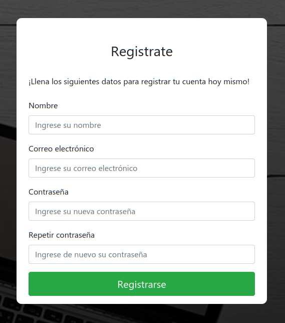

# Tasker (Actualmente en desarrollo (alpha))
Sistema multiusuarios para leer, crear, editar y eliminar notas y recordatorios.
  
## ~ Tecnologías usadas para la realización de este proyecto ~
HTML, CSS, JS, Vue, PHP y SQL
  
## ~ Login de usuarios ~
El usuario puede ingresar a través de su cuenta con su correo y contraseña.
  

  
## ~ Registro de usuarios ~
El usuario es capaz de poder registrarse; al hacerlo, deberá de verificar su cuenta con el correo electrónico que el sistema le envía a su bandeja.
  

  
## ~ Dashboard ~
Dentro del dashboard el usuario puede ver, crear, editar y eliminar las tareas, así como también modificar aspectos de su cuenta.
  

   
# # Autor
Proyecto realizado por: Lombardo Moreno Rodríguez.
